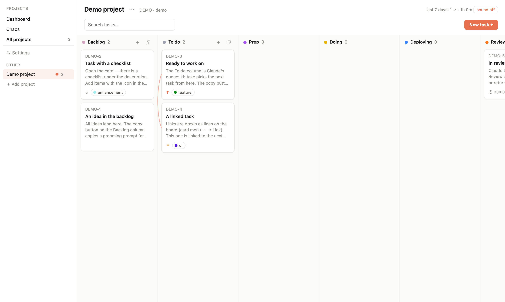
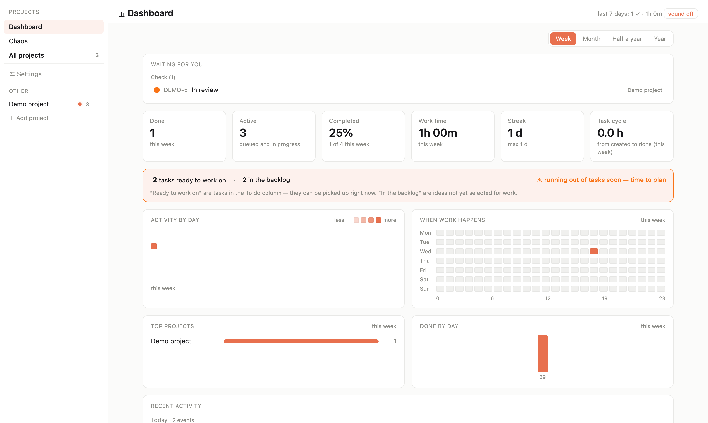

# local-kanban

[](https://github.com/lamaohub/local-kanban/actions/workflows/test.yml)

A local kanban board built for working **in tandem with Claude Code**: the human plans and accepts tasks, Claude takes them from the queue, does the work and reports back — all through a token-efficient CLI called `kb`. Optionally mirrors everything to GitHub (issues + Projects v2).

Русская версия — [README.ru.md](README.ru.md).





## Why

- **A queue for Claude, not just a board.** Statuses model the real loop: `backlog → todo → prep → doing → deploy → review → done`. Claude pulls the next task with `kb take`, works, and stops at *review* — accepting is always the human's call.
- **Local-first.** Everything lives in a single SQLite file on your machine. GitHub sync is optional and off until you configure it.
- **Honest metrics.** Work time is measured only while Claude actually works; the dashboard shows streaks, cycle time and what's waiting for you.

## Security model — read this first

The server listens on **127.0.0.1 only** and has **no authentication**. The board is strictly local: your machine is the trust boundary. **Never expose the port to the network** (no reverse proxies, no `0.0.0.0`, no port forwarding). Third-party integrations should run on the same machine and talk to `127.0.0.1` (see [docs/API.md](docs/API.md)).

## Requirements

- **Node.js ≥ 22** (macOS or Linux) — 24 LTS or newer is what most people have
- Optional, only for GitHub sync: [`gh` CLI](https://cli.github.com/) authenticated with the `project` scope:
  `gh auth login && gh auth refresh -s project`

## Install

```bash
npm install -g local-kanban
local-kanban            # setup wizard
local-kanban start      # board at http://localhost:3100
```

The wizard asks for the port, data directory, whether you want GitHub sync and where to install the Claude Code skills — every question has a default, so Enter-Enter-Enter is enough. It also writes `ecosystem.config.cjs` for autostart under [pm2](https://pm2.keymetrics.io/).

`local-kanban start` takes `--port <N>` and `--data <dir>`. Data lives in `~/.local-kanban` by default, outside the package directory, so updating the package never touches your board.

From source:

```bash
git clone <repo-url> local-kanban && cd local-kanban
npm install
npx local-kanban     # setup wizard (optional)
npm start            # board at http://localhost:3100
```

To get the `kb` command globally: `npm link` (or `npm install -g .`).

First launch shows an empty dashboard with an optional **demo project** — one click creates it, one click removes it.

### Let Claude finish the setup

The last step of the first-run wizard shows a ready-made prompt (in the board's language). Paste it
into Claude Code and it will walk you through the rest — check that `kb` works, ask whether you want
the GitHub mirror, register your first projects with their paths and deploys, and verify the result.
The same prompt lives in **Settings → About**, so you can come back to it later.

### Claude Code skills

The repo ships two skills for Claude Code in `skills/`:

- `skills/kanban` — teaches Claude the task workflow (`kb take` → work → `kb review`);
- `skills/deploy` — a generic deploy flow driven by the project registry (`kb info`).

Install by symlink or copy:

```bash
ln -s "$(pwd)/skills/kanban" ~/.claude/skills/kanban
ln -s "$(pwd)/skills/deploy" ~/.claude/skills/deploy
```

## GitHub sync (optional)

Set the owner and issues repo in **Settings → Sync** on the board (or env `KB_GH_OWNER` / `KB_GH_REPO`). Without them the board runs in local-only mode: no queue, no warnings. With them, every task becomes an issue and every project gets a `kb: <slug>` GitHub Project with matching columns. Sync is one-way (board → GitHub) and runs in the background.

## Updating

From npm:

```bash
npm install -g local-kanban@latest
local-kanban skills          # refresh the Claude Code skills — they are a copy, not a link
```

From a clone:

```bash
npm run update   # git pull + npm install + pm2 restart (if applicable)
```

Your data is never touched by updates: `data/` is gitignored and schema migrations run automatically on start — **with a pre-migration snapshot** saved to `data/backups/pre-migrate/` before anything changes.

**Rollback:** stop the server, restore the latest file from `data/backups/` (daily) or `data/backups/pre-migrate/` over `data/kanban.db`, then `git checkout <previous tag>` and start again.

Releases live in `main` (stable, tagged); day-to-day development happens in `dev`.

## Environment variables

| Variable | Default | Meaning |
|---|---|---|
| `PORT` | `3100` | HTTP port (bound to 127.0.0.1) |
| `KB_DATA_DIR` | `./data` | data directory (SQLite, attachments, backups) |
| `KB_LOCAL_ROOT` | `~/claude-projects` | root folder scanned for local projects |
| `KB_URL` | `http://127.0.0.1:3100` | board URL for the `kb` CLI |
| `KB_GH_OWNER` / `KB_GH_REPO` | — | GitHub sync target; empty = sync off (can also be set in Settings) |
| `KB_PANEL_URL` | — | custom HTTP source of service statuses; empty = local `pm2 jlist` |
| `KB_PANEL_INFO` | — | optional path to an external panel's info.json for category sync |
| `KB_SSE_MAX` | `20` | cap on concurrent SSE connections |
| `KB_SKILLS_EXTRA` | — | extra skill root directories, `:`-separated |

The legacy names `PANEL_URL` and `PANEL_INFO` (without the prefix) still work as a fallback.

## Metrics and the `noclaude` label

Tasks done **by hand** (without Claude) get the `noclaude` label — they are counted separately on the dashboard and excluded from Claude's metrics (work time, cycle, completion %), which would otherwise be skewed by their zero work time. The label is optional and can be added later. Manual tasks are also allowed to jump straight to *review*/*done*.

## Extending

The full HTTP API and the SSE event stream are the official extension point — build bots, stats, integrations as separate programs, no plugins inside the page. See [docs/API.md](docs/API.md).

## Development

```bash
node --test   # DB isolated via KB_DATA_DIR
```

See [CONTRIBUTING.md](CONTRIBUTING.md) for the dev setup, branch flow and the schema-migration rule. The architecture is described in [ARCHITECTURE.md](ARCHITECTURE.md), and what changed between versions in [CHANGELOG.md](CHANGELOG.md).

## UI language

English is the source language of the interface; Russian comes as a translation. The board follows your system language and can be switched in **Settings → General** — a string with no translation yet stays English rather than leaking into the wrong locale.

## License

[MIT](LICENSE).
